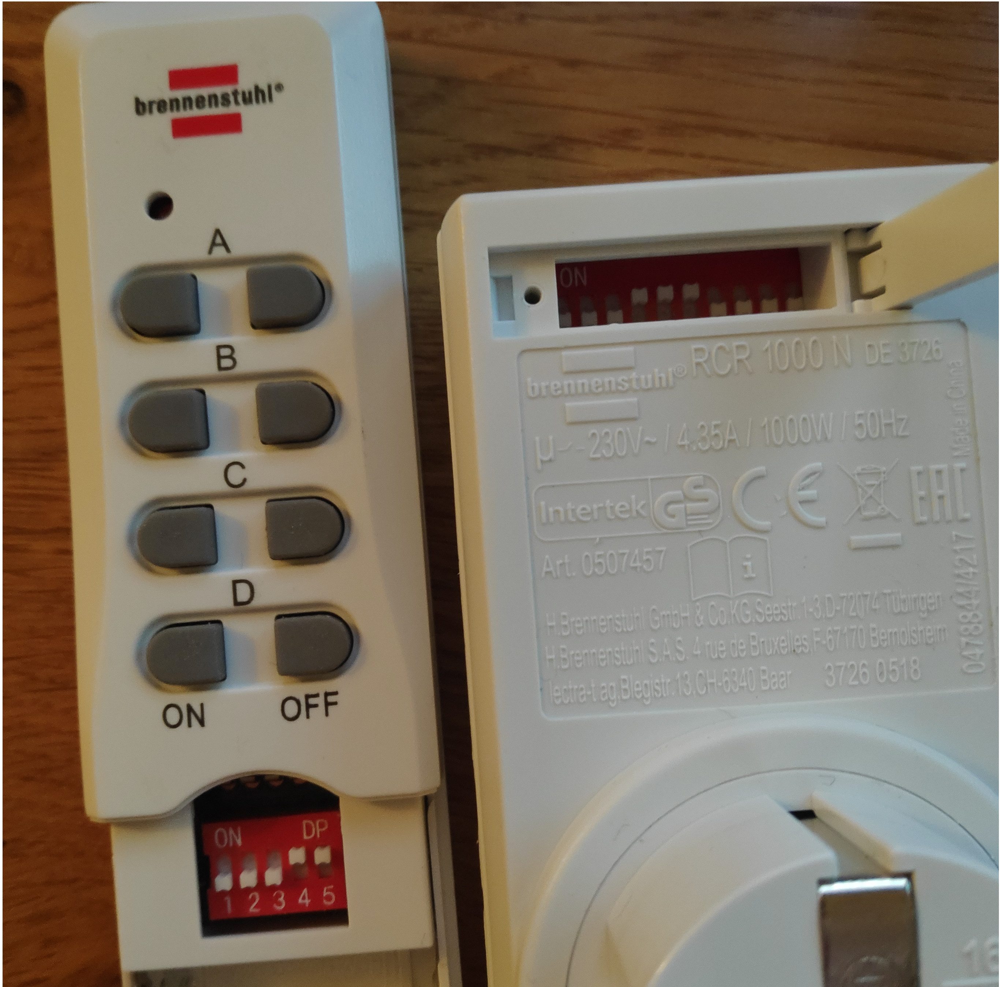

# pi brennenstuhl server application


## Clone project
```
git clone --recursive git@github.com:fischer-matthias/pi-brennenstuhl-server-app.git
```

## Requirements
- [WiringPi](https://projects.drogon.net/raspberry-pi/wiringpi/download-and-install/)

## Install
```
npm install
npm run build
```

## Run server
```
npm start
```

## API
```
/api/system/:id/unit/[A,B,C,D]/[on,off]
```


in this case:

| system | unit | path |
|---|---|---|
| 00011 | A | /api/system/00011/unit/A/[on,off] |

## Credits
 - [cpp code: 433Utils by ninjablocks](https://github.com/ninjablocks/433Utils)
 - [rc-switch by sui77](https://github.com/sui77/rc-switch)